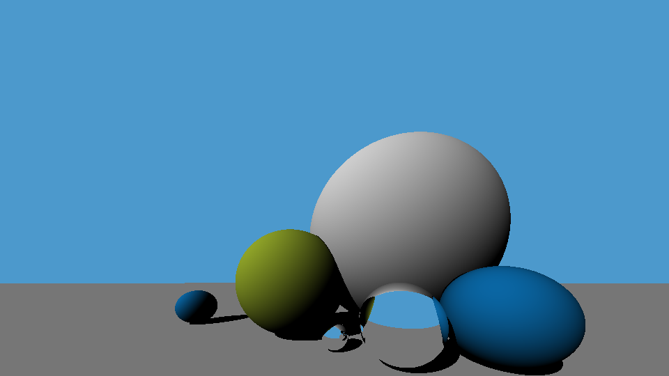

# raytrace-rs

[](https://github.com/drumath2237/raytrace-rs/actions/workflows/rust.yml)

## About

Rustの勉強として作った古典的レイトレーサ―



## Environment

|項目|環境|
|---|---|
|OS|Windows 10 Home|
|Rust|1.54.0|

## Usage

```shell
# run
cargo run

#test
cargo test
```

## Contact

何かございましたら[にー兄さんのTwitter](https://twitter.com/ninisan_drumath)
までご連絡ください。